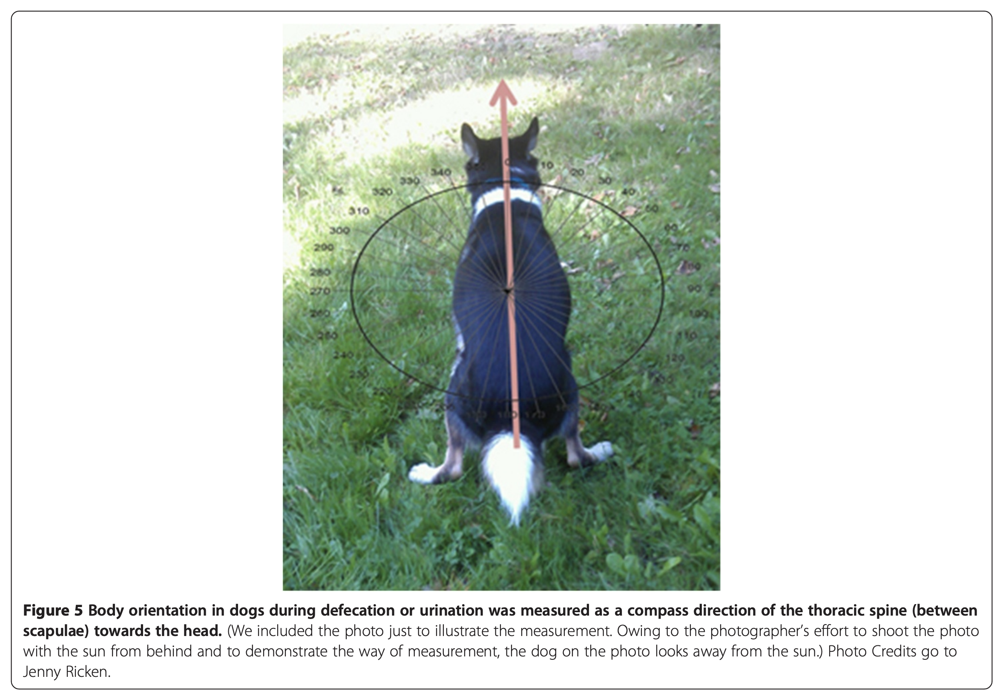
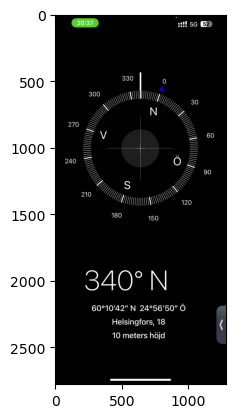
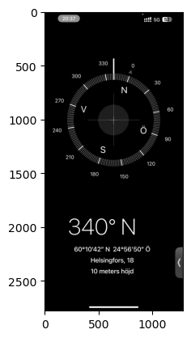
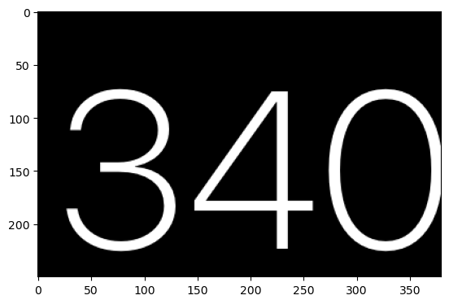
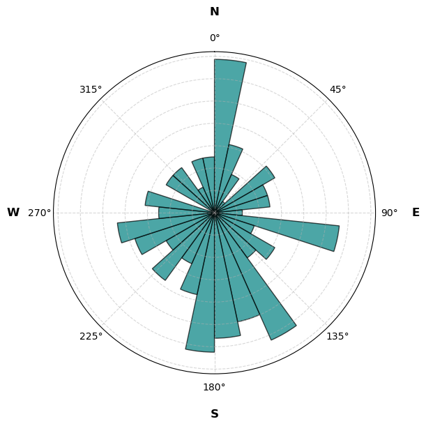
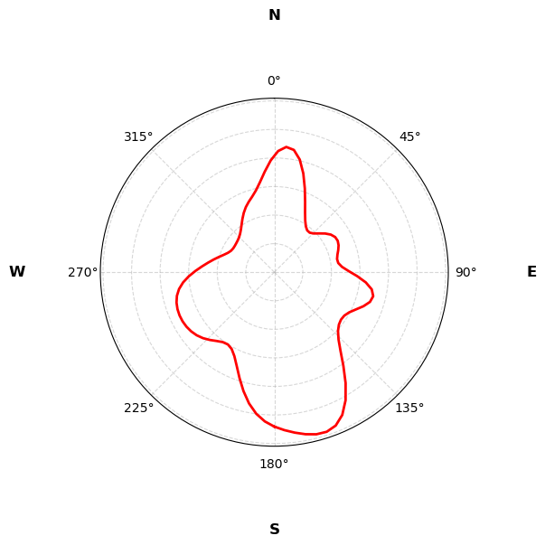
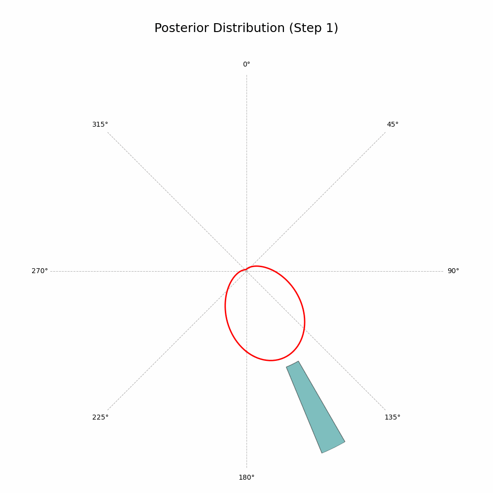
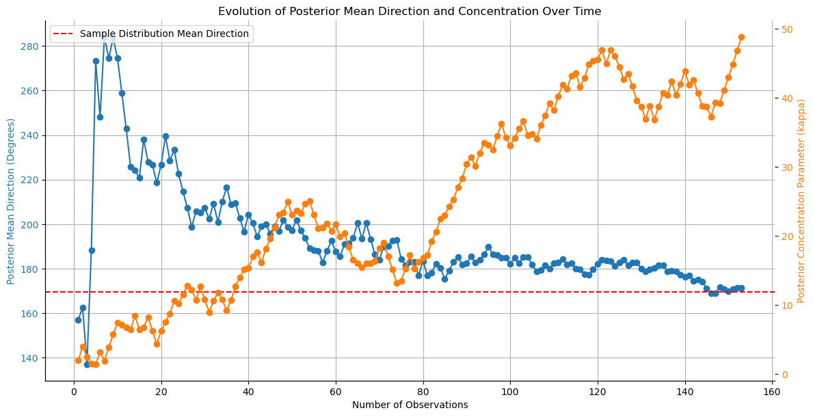

# Dog Poop Compass: Bayesian Analysis of Canine Business

# tl;dr

Do dogs poop facing North and South? Turns out they do! Want to learn how to measure this at home using a compass app, Bayesian statistics, and one dog (dog not included), jump in!

# Introduction

This is my dog. His name is Auri and he is a 5 year old Cavalier King Charles Spaniel.

<p align="center">

</p>

As many other dog owners, during our walks I noticed that Auri has a very particular ritual when he needs to go to the bathroom. When he finds a perfect spot he starts circling around something like a compass.

At first I was simply amused by this behaviour. After all, who knows what goes through a dog's mind? But after a while I remembered reading a research paper from 2013 titled [“Dogs are sensitive to small variations of the Earth’s magnetic field”](https://frontiersinzoology.biomedcentral.com/counter/pdf/10.1186/1742-9994-10-80.pdf). The research was conducted on a relatively large sample of dogs and confirmed that “dogs preferred to excrete with the body being aligned along the north-south axis”.


Now that could be an interesting research to try out! I thought to myself. And how lucky that I have a perfect test subject, a lovely canine of my own. I decided to replicate the findings and confirm (or debunk!) the hypothesis with Auri, my N=1 unsuspecting research participant.

And so began my long journey of data collection spanning multiple months and capturing over 150 of “alignment sessions” if you catch my drift.

# Data Collection

For my study, I needed to have a compass measurement for every time Auri pooped. Thank to modern technological advancements we not only have [a calculator app for iPad](https://www.theverge.com/2024/6/10/24175487/ipad-calculator-app-ipados18-pencil-apple-wwdc2024) but also a [fairly accurate](https://www.simplymac.com/apps/how-accurate-is-the-iphone-compass) compass on a phone. And that’s what I decided to use.

The approach was very simple. Every time my dog settled to have some private time I opened the compass app, aligned my phone along Auri’s body and took a screenshot. In the original paper the authors eloquently called the alignment as *a compass direction of the thoracic spine (between scapulae) towards the head*. Very scientific. All it means is that the compass arrow is supposed to point at the same direction as dog’s head.

<p align="center">

</p>

Anyways, that’s what I did in total 150 something times over the course of a few months. I could almost sense the passer bys’ confusion mixed with curiosity as I was seemingly taking pictures of all my dog’s relief acts. But was it worth it? Let’s find out!

# Analysis

I’ll briefly discuss the data extraction and preprocessing here and then jump straight to working with circular distributions and hypothesis testing.

As always, all the code can be found on my GitHub here: //TODO link to repository.

## How to process app screenshots?

After data collection I had 128 screenshots of the compass app:

<p align="center">

</p>

Being lazy as I am I didn’t feel like scrolling through all of them patiently writing down the compass degrees. So I decided to send all those images to my notebook and automate the process.

<p align="center">


The task was simple — all I needed from the images was the big numbers at the bottom of the screen. Fortunately, there are a lot of small pretrained networks out there that can do basic [OCR](https://en.wikipedia.org/wiki/Optical_character_recognition) (stands for Optical character recognition). I opted for an [`easyocr`](https://github.com/JaidedAI/EasyOCR) package which was a bit on a slower end but free and easy to work with.

I'll walk you through a quick example of using `easyocr` alongside with [`opencv`](https://opencv.org/) to extract the numbers from a single screenshot.

First, let's load the image and display it:

```python
import cv2
import os

image_dir = '../data/raw/'
img = cv2.imread(image_dir + 'IMG_6828.png')

plt.imshow(img)
plt.show()
```

<p align="center">

</p>

Next, I convert the image to greyscale to remove any color information and make it less noisy:

```python
gray = cv2.cvtColor(img, cv2.COLOR_BGR2GRAY)
plt.imshow(gray, cmap='gray')
plt.show()
```

<p align="center">

</p>

And then I zoom in on the area of interest:

```python
plt.imshow(gray[1850:2100, 200:580], cmap='gray')
plt.show()
```

<p align="center">

</p>

Finally, I use `easyocr` to extract the numbers from the image. It does extract both the number and the confidence score but I am only interested in the number.

```python
import easyocr

reader = easyocr.Reader(['en'])
result = reader.readtext(gray[1850:2100, 200:580])
for bbox, text, prob in result:
    print(f"Detected text: {text} with confidence {prob}")

```
```
>> Detected text: 340 with confidence 0.999995182215476
```

And that's it! I wrote a simple for loop to iterate through all the screenshots and saved the results to a CSV file. 

Here's a link to the full preprocessing notebook: //TODO link to notebook and a snippet of the resulting dataset:

| index | image_path | degrees |
|-------|------------|---------|
| 0 | ../data/raw/IMG_4514.PNG | 157.0 |
| 1 | ../data/raw/IMG_4272.PNG | 168.0 |
| 2 | ../data/raw/IMG_4312.PNG | 16.0 |
| 3 | ../data/raw/IMG_4448.PNG | 281.0 |
| 4 | ../data/raw/IMG_4449.PNG | 322.0 |


## Spinning the wheel: Circular Distributions

I don't usually work with circular distributions so I had to do some reading. Unlike regular data that we are used to, circular data has a peculiar property: the "ends" of the distribution are connected. 

For example, if you take the distribution of hours in a day, you would find that the distance between 23:00 and 00:00 is the same as between 00:00 and 01:00. Or, in the case of compass degrees, the distance between 359° and 0° is the same as between 0° and 1°.

Even calculating a sample mean is not straightforward. A standard arithmetic mean between 360° and 0° would give 180° although both 360° and 0° point to the exact same direction. 

Similarly in my case, I got almost perfectly opposite estimates when calculating the mean in an arithmetic and in correct way. I converted the degrees to radians using a helper function from this nice library: [pingouin](https://pingouin-stats.org/build/html/generated/pingouin.convert_angles.html#pingouin.convert_angles) and calculated the mean using the `circ_mean` function. 

```python
from pingouin import circ_mean

arithmetic_mean = data['radians'].mean()
circular_mean = circ_mean(data['radians'])

print(f"Arithmetic mean: {arithmetic_mean:.3f}; Circular mean: {circular_mean:.3f}")
```
```
>> Arithmetic mean: 0.082; Circular mean: 2.989
```

Next, I wanted to visualize the compass distribution. I used the [Von Mises distribution](https://docs.scipy.org/doc/scipy/reference/generated/scipy.stats.vonmises.html) to model the circular data and drew the polar plot using [matplotlib](https://matplotlib.org/stable/gallery/pie_and_polar_charts/polar_demo.html).

> The **Von Mises** distribution is the circular analogue of the normal distribution. It is defined by two parameters: the mean location $\mu$ and the concentration $\kappa$. The concentration parameter controls the spread and is analogous to the inverse of the variance. When $\kappa$ is 0 the distribution is uniform, as $\kappa$ increases the distribution contracts around the mean.

Let's import the necessary libraries and define the helper functions:

```python
import pandas as pd
import numpy as np
import matplotlib.pyplot as plt
import seaborn as sns

from scipy.stats import vonmises
from pingouin import convert_angles
from typing import Tuple, List


def vonmises_kde(series: np.ndarray, kappa: float, n_bins: int = 100) -> Tuple[np.ndarray, np.ndarray]:
    """
    Estimate a von Mises kernel density estimate (KDE) over circular data using scipy.
    
    Parameters:
    series: np.ndarray 
        The input data in radians, expected to be a 1D array.
    kappa: float
        The concentration parameter for the von Mises distribution.
    n_bins: int
        The number of bins for the KDE estimate (default is 100).
    
    Returns:
    bins: np.ndarray
        The bin edges (x-values) used for the KDE.
    kde: np.ndarray
        The estimated density values (y-values) for each bin.
    """
    bins = np.linspace(-np.pi, np.pi, n_bins)
    kde = np.zeros(n_bins)
    
    for angle in series:
        kde += vonmises.pdf(bins, kappa, loc=angle)
    
    kde = kde / len(series)
    return bins, kde


def plot_circular_distribution(
    data: pd.DataFrame,
    plot_type: str = 'kde',
    bins: int = 30,
    figsize: tuple = (4, 4),
    **kwargs
) -> None:
    """
    Plot a compass rose with either KDE or histogram for circular data.
    
    Parameters:
    -----------
    data: pd.DataFrame
        DataFrame containing 'degrees'and 'radians' columns with circular data
    plot_type: str
        Type of plot to create: 'kde' or 'histogram'
    bins: int
        Number of bins for histogram or smoothing parameter for KDE
    figsize: tuple
        Figure size as (width, height)
    **kwargs: dict
        Additional styling arguments for histogram (color, edgecolor, etc.)
    """
    plt.figure(figsize=figsize)
    ax = plt.subplot(111, projection='polar')

    ax.set_theta_zero_location('N')
    ax.set_theta_direction(-1)

    # add cardinal directions
    directions = ['N', 'E', 'S', 'W']
    angles = [0, np.pi / 2, np.pi, 3 * np.pi / 2]
    for direction, angle in zip(directions, angles):
        ax.text(
            angle, 0.45, direction,
            horizontalalignment='center',
            verticalalignment='center',
            fontsize=12,
            weight='bold'
        )

    if plot_type.lower() == 'kde':
        x, kde = vonmises_kde(data['radians'].values, bins)
        ax.plot(x, kde, color=kwargs.get('color', 'red'), lw=2)
    
    elif plot_type.lower() == 'histogram':
        hist_kwargs = {
            'color': 'teal',
            'edgecolor': 'black',
            'alpha': 0.7
        }
        hist_kwargs.update(kwargs) 
        
        angles_rad = np.deg2rad(data['degrees'].values)
        counts, bin_edges = np.histogram(
            angles_rad, 
            bins=bins, 
            range=(0, 2*np.pi), 
            density=True
        )
        widths = np.diff(bin_edges)
        ax.bar(
            bin_edges[:-1],
            counts,
            width=widths,
            align='edge',
            **hist_kwargs
        )
    
    else:
        raise ValueError("plot_type must be either 'kde' or 'histogram'")
    
    ax.xaxis.grid(True, linestyle='--', alpha=0.5)
    ax.yaxis.grid(True, linestyle='--', alpha=0.5)
    ax.set_yticklabels([]) 
    plt.show()
```

Now let's load the data and plot the charts:

```python
data = pd.read_csv('../data/processed/compass_degrees.csv', index_col=0)
data['radians'] = convert_angles(data['degrees'], low=0, high=360)

plot_circular_distribution(data, plot_type='histogram', figsize=(6, 6))
plot_circular_distribution(data, plot_type='kde', figsize=(5, 5))
```

<p align="center">

</p>

From the histogram it's clear that Auri has his preferences when choosing the relief direction. There's a clear spike towards the North and a dip towards the South. Nice! 

<p align="center">

</p>

With the KDE plot we get a smoother representation of the distribution. And the good news is that it is very far from being a uniform circle. 

It's time to validate it statistically!

## Statistically Significant Poops

Just as circular data requires special treatment for visualizations and distributions, it also requires special statistical tests. 

I'll be using a few tests from the [pingouin](https://pingouin-stats.org/) library I already mentioned earlier. The first test I'll use is the [Rayleigh test](https://en.wikipedia.org/wiki/Rayleigh_test) which is a test for uniformity of circular data. The null hypothesis claims that the data is uniformly distributed around the circle and the alternative is that it is not.

```python
from pingouin import circ_rayleigh

z, pval = circ_rayleigh(data['radians'])
print(f"Z-statistics: {z:.3f}; p-value: {pval:.6f}")
```
```
>> Z-statistics: 3.893; p-value: 0.020128
```

Good news, everyone! The p-value is less than 0.05 and we reject the null hypothesis. Auri's strategic poop positioning is not random! 

The only downside is that the test [assumes](https://pingouin-stats.org/build/html/generated/pingouin.circ_rayleigh.html#:~:text=The%20assumptions%20for%20the%20Rayleigh%20test%20are%20that%20(1)%20the%20distribution%20has%20only%20one%20mode%20and%20(2)%20the%20data%20is%20sampled%20from%20a%20von%20Mises%20distribution.) that the distribution has only one mode and the data is sampled from a von Mises distribution. Oh well, let's try something else then. Auri's data clearly has multiple modes. 

The next on the list is the [V-test](https://pingouin-stats.org/build/html/generated/pingouin.circ_vtest.html). This test checks if the data is non-uniform with a specified mean direction. From the documentation we get that:
> The V test has more power than the Rayleigh test and is preferred if there is reason to believe in a specific mean direction.

Perfect! Let's try it. 

From the distribution it's clear that Auri prefers the South direction above all. I'll set the mean direction to $\pi$ radians (South) and run the test.

```python
from pingouin import circ_vtest

v, pval = circ_vtest(data['radians'], dir=np.pi)
print(f"V-statistics: {v:.3f}; p-value: {pval:.6f}")
```
```
>> V-statistics: 24.127; p-value: 0.002904
```

Now we're getting somewhere! The p-value is close to zero and we reject the null hypothesis. Auri is a statistically significant South-facing pooper!

## Bayesian Poops: Math Part

And now for something completely different. Let's try a Bayesian approach. 

To start, I decided to see how estimate of the mean direction changes as the sample size increased. The idea is simple: I'll start with a circular uniform prior distribution and update it with every new data point. 

We'll need to define a few things, so let's get down to math. If you're not a fan of equations, feel free to skip to the next section with cool visualizations! 

### 1. The von Mises Distribution
The von Mises distribution \( p(\theta | \mu, \kappa) \) has a probability density function given by:
\[
p(\theta | \mu, \kappa) = \frac{\exp(\kappa \cos(\theta - \mu))}{2 \pi I_0(\kappa)}
\]
where:
- \( \mu \) is the mean direction
- \( \kappa \) is the concentration parameter (analogous to the inverse of the variance in a normal distribution)
- \( I_0(\kappa) \) is the modified Bessel function of the first kind, ensuring the distribution is normalized

### 2. Prior and Likelihood
Suppose we have:
- **Prior** \( p(\theta | \mu_{\text{prior}}, \kappa_{\text{prior}}) \) with parameters \( (\mu_{\text{prior}}, \kappa_{\text{prior}}) \).
- **Likelihood** \( p(\theta | \theta_n, \kappa_{\text{likelihood}}) \) for a new observation \( \theta_n \) with parameters \( (\theta_n, \kappa_{\text{likelihood}}) \).

We want to update our prior using Bayes' theorem:
\[
p(\theta | \text{data}) \propto p(\theta | \mu_{\text{prior}}, \kappa_{\text{prior}}) \cdot p(\text{data} | \theta)
\]
where \( p(\text{data} | \theta) = p(\theta | \theta_n, \kappa_{\text{likelihood}}) \).

### 3. Multiply the Prior and Likelihood in the von Mises Form
The product of two von Mises distributions (with parameters \( (\mu_1, \kappa_1) \) and \( (\mu_2, \kappa_2) \)) leads to another von Mises distribution with updated parameters. Let’s go through the steps:

Given:
\[
p(\theta | \mu_{\text{prior}}, \kappa_{\text{prior}}) = \frac{\exp(\kappa_{\text{prior}} \cos(\theta - \mu_{\text{prior}}))}{2 \pi I_0(\kappa_{\text{prior}})}
\]
and
\[
p(\theta | \theta_n, \kappa_{\text{likelihood}}) = \frac{\exp(\kappa_{\text{likelihood}} \cos(\theta - \theta_n))}{2 \pi I_0(\kappa_{\text{likelihood}})}
\]

the posterior is proportional to the product:
\[
p(\theta | \text{data}) \propto \exp(\kappa_{\text{prior}} \cos(\theta - \mu_{\text{prior}})) \cdot \exp(\kappa_{\text{likelihood}} \cos(\theta - \theta_n))
\]

Using the trigonometric identity for the sum of cosines:
$$
\begin {align*}
\cos(\theta - \mu_{\text{prior}}) + \cos(\theta - \theta_n) = &\cos(\theta) ( \cos(\mu_{\text{prior}}) + \cos(\theta_n)) \\
& + \sin(\theta) (\sin(\mu_{\text{prior}}) + \sin(\theta_n))
\end {align*} 
$$

This becomes:
$$
\begin{align*}
p(\theta | \text{data}) \propto & \exp\Big(\left(\kappa_{\text{prior}} \cos(\mu_{\text{prior}}) + \kappa_{\text{likelihood}} \cos(\theta_n)\right) \cos(\theta) \\
& + \left(\kappa_{\text{prior}} \sin(\mu_{\text{prior}}) + \kappa_{\text{likelihood}} \sin(\theta_n)\right) \sin(\theta)\Big)
\end{align*}
$$

### 4. Convert to Polar Form for the Posterior 

Final stretch! The expression above is a von Mises distribution in disguise. We can rewrite it in the polar form to estimate the updated mean direction and concentration parameter.

Let:
\[
C = \kappa_{\text{prior}} \cos(\mu_{\text{prior}}) + \kappa_{\text{likelihood}} \cos(\theta_n)
\]
\[
S = \kappa_{\text{prior}} \sin(\mu_{\text{prior}}) + \kappa_{\text{likelihood}} \sin(\theta_n)
\]

Now the expression for posterior simplifies to:
\[
p(\theta | \text{data}) \propto \exp(C \cos(\theta) + S \sin(\theta))
\]

Let's pause here and take a closer look at the simplified expression. 


1. Notice that $C \cos(\theta) + S \sin(\theta)$ is the dot product of two vectors $(C, S)$ and $(\cos(\theta), \sin(\theta))$ which we can represent as:

$$
C \cos(\theta) + S \sin(\theta) = |(C, S)| \cdot |(\cos(\theta), \sin(\theta))| \cdot \cos(\phi), 
$$

where $\phi$ is the angle between the vectors $(C, S)$ and $(\cos(\theta), \sin(\theta))$.

2. The magnitudes of the vectors are:
$$
|(C, S)| = \sqrt{C^2 + S^2} \\
|(\cos(\theta), \sin(\theta))| = 1
$$ 

3. The angle between the vector $(\cos(\theta), \sin(\theta))$ and a positive x-axis is just $\theta$ and between $(C, S)$ and a positive x-axis is, by definition:
$$
\phi = \arctan2(S, C)
$$

4. So the angle between the two vectors is:
$$
\cos(\phi) = \cos(\theta - \arctan2(S, C))
$$

Substitute our findings back into the simplified expression for the posterior:

$$
p(\theta | \text{data}) \propto \exp\left(\sqrt{C^2 + S^2} \cos(\theta - \arctan2(S, C))\right)
$$

or, 

$$
p(\theta | \text{data}) \propto \exp\left(\kappa_{\text{post}} \cos(\theta - \mu_{\text{post}})\right)
$$

where:
- $\kappa_{\text{post}}$ is the posterior concentration parameter:

$$\kappa_{\text{post}} = \sqrt{C^2 + S^2}$$
- $\mu_{\text{post}}$ is the posterior mean direction:
$$ \mu_{\text{post}} = \arctan2(S, C)$$ 

Yay, we made it! The posterior is also a von Mises distribution with updated parameters \( (\mu_{\text{post}}, \kappa_{\text{post}}) \). Now we can update the prior with every new observation and see how the mean direction changes.


## Bayesian Poops: Fun Part

Welcome back to those of you who skipped the math and congratulations to those who made it through! Let's code the Bayesian update and vizualize the results.

First, let's define the helper functions for visualizing the posterior distribution. We'll need to it to create a nice animation later on.

```python
import imageio
from io import BytesIO

def get_posterior_distribution_image_array(
    mu_grid: np.ndarray, 
    posterior_pdf: np.ndarray, 
    current_samples: List[float], 
    idx: int, 
    fig_size: Tuple[int, int], 
    dpi: int, 
    r_max_posterior: float
) -> np.ndarray:
    """
    Creates the posterior distribution and observed samples histogram on a polar plot, 
    converts it to an image array, and returns it for GIF processing.

    Parameters:
    -----------

    mu_grid (np.ndarray): 
        Grid of mean direction values for plotting the posterior PDF.
    posterior_pdf (np.ndarray): 
        Posterior probability density function values for the given `mu_grid`.
    current_samples (List[float]): 
        List of observed angle samples in radians.
    idx (int): 
        The current step index, used for labeling the plot.
    fig_size (Tuple[int, int]): 
        Size of the plot figure (width, height).
    dpi (int): 
        Dots per inch (resolution) for the plot.
    r_max_posterior (float): 
        Maximum radius for the posterior PDF plot, used to set plot limits.

    Returns:
        np.ndarray: Image array of the plot in RGB format, suitable for GIF processing.
    """
    fig = plt.figure(figsize=fig_size, dpi=dpi)
    ax = plt.subplot(1, 1, 1, projection='polar')
    ax.set_theta_zero_location('N')  
    ax.set_theta_direction(-1)  
    ax.plot(mu_grid, posterior_pdf, color='red', linewidth=2, label='Posterior PDF')

    # observed samples histogram
    n_bins = 48
    hist_bins = np.linspace(-np.pi, np.pi, n_bins + 1)
    hist_counts, _ = np.histogram(current_samples, bins=hist_bins)

    # normalize the histogram counts
    if np.max(hist_counts) > 0:
        hist_counts_normalized = hist_counts / np.max(hist_counts)
    else:
        hist_counts_normalized = hist_counts

    bin_centers = (hist_bins[:-1] + hist_bins[1:]) / 2
    bin_width = hist_bins[1] - hist_bins[0]

    # set the maximum radius to accommodate both the posterior pdf and histogram bars
    r_histogram_height = r_max_posterior * 0.9 
    r_max = r_max_posterior + r_histogram_height
    ax.set_ylim(0, r_max)

    # plot the histogram bars outside the circle
    for i in range(len(hist_counts_normalized)):
        theta = bin_centers[i]
        width = bin_width
        hist_height = hist_counts_normalized[i] * r_histogram_height
        if hist_counts_normalized[i] > 0:
            ax.bar(
                theta, hist_height, width=width, bottom=r_max_posterior, 
                color='teal', edgecolor='black', alpha=0.5
            )

    ax.text(
        0.5, 1.1, f'Posterior Distribution (Step {idx + 1})', 
        transform=ax.transAxes, ha='center', va='bottom', fontsize=18
    )
    ax.set_yticklabels([])
    ax.grid(linestyle='--')
    ax.yaxis.set_visible(False)
    ax.spines['polar'].set_visible(False)
    plt.subplots_adjust(top=0.85, bottom=0.05, left=0.05, right=0.95)

    # saving to buffer for gif processing
    buf = BytesIO()
    plt.savefig(buf, format='png', bbox_inches=None, pad_inches=0)
    buf.seek(0)
    img_array = plt.imread(buf)
    img_array = (img_array * 255).astype(np.uint8)
    plt.close(fig)
    return img_array
```

Now we're ready to write the update loop. Remember that we need to set our prior distribution. I'll start with a circular uniform distribution which is equivalent to a von Mises distribution with a concentration parameter of 0. For the $\kappa_\text{likelihood}$ I'll set a fixed moderate concentration parameter of 2. That'll make the posterior update more visible.

```python
# initial prior parameters
mu_prior = 0.0  # initial mean direction (any value, since kappa_prior = 0)
kappa_prior = 0.0  # uniform prior over the circle

# fixed concentration parameter for the likelihood
kappa_likelihood = 2.0

posterior_mus = []
posterior_kappas = []

mu_grid = np.linspace(-np.pi, np.pi, 200)

# vizualisation parameters
fig_size = (10, 10)
dpi = 100

current_samples = []
frames = []

for idx, theta_n in enumerate(data['radians']):

    # compute posterior parameters
    C = kappa_prior * np.cos(mu_prior) + kappa_likelihood * np.cos(theta_n)
    S = kappa_prior * np.sin(mu_prior) + kappa_likelihood * np.sin(theta_n)
    kappa_post = np.sqrt(C**2 + S**2)
    mu_post = np.arctan2(S, C)

    # posterior distribution
    posterior_pdf = np.exp(kappa_post * np.cos(mu_grid - mu_post)) / (2 * np.pi * i0(kappa_post))

    # store posterior parameters and observed samples
    posterior_mus.append(mu_post)
    posterior_kappas.append(kappa_post)
    current_samples.append(theta_n)

    # plot posterior distribution
    r_max_posterior = max(posterior_pdf) * 1.1
    img_array = get_posterior_distribution_image_array(
        mu_grid, 
        posterior_pdf, 
        current_samples, 
        idx, 
        fig_size, 
        dpi, 
        r_max_posterior
        )
    frames.append(img_array)

    # updating priors for next iteration
    mu_prior = mu_post
    kappa_prior = kappa_post

# Create GIF
fps = 10
frames.extend([img_array]*fps*3) # repeat last frame a few times to make a "pause" at the end of the GIF
imageio.mimsave('../images/posterior_updates.gif', frames, fps=fps)
```

And that's it! The code will generate a GIF showing the posterior distribution update with every new observation. Here's the glorious result:

<p align="center">

</p>

As you can see, with every new observation the posterior distribution gets more and more concentrated around the true mean direction. If only I could replace the red line with Auri's silhouette, it would be perfect!

We can further visualize the history of the posterior mean direction and concentration parameter. Let's plot them:

```python
# Convert posterior_mus to degrees
posterior_mus_deg = np.rad2deg(posterior_mus) % 360
n_samples = data.shape[0]
true_mu = data['degrees'].mean()
# Plot evolution of posterior mean direction
fig, ax1 = plt.subplots(figsize=(12, 6))

color = 'tab:blue'
ax1.set_xlabel('Number of Observations')
ax1.set_ylabel('Posterior Mean Direction (Degrees)', color=color)
ax1.plot(range(1, n_samples + 1), posterior_mus_deg, marker='o', color=color)
ax1.tick_params(axis='y', labelcolor=color)
ax1.axhline(true_mu, color='red', linestyle='--', label='Sample Distribution Mean Direction')
ax1.legend(loc='upper left')
ax1.grid(True)

ax2 = ax1.twinx()  # instantiate a second axes that shares the same x-axis
color = 'tab:orange'
ax2.set_ylabel('Posterior Concentration Parameter (kappa)', color=color)  # we already handled the x-label with ax1
ax2.plot(range(1, n_samples + 1), posterior_kappas, marker='o', color=color)
ax2.tick_params(axis='y', labelcolor=color)

fig.tight_layout()  # otherwise the right y-label is slightly clipped
sns.despine()
plt.title('Evolution of Posterior Mean Direction and Concentration Over Time')
plt.show()
```

<p align="center">

</p>

The plot shows how the posterior mean direction and concentration parameter evolve with every new observation. The mean direction quickly converges to the true value, while the concentration parameter increases, indicating the distribution is getting more concentrated.

## Bayes Factors
```python
import pymc as pm
import arviz as az
from scipy.stats import halfnorm, gaussian_kde
```

References:
- Dogs are sensitive to small variations of the Earth’s magnetic field, Vlastimil Hart et al., [[link]](https://frontiersinzoology.biomedcentral.com/counter/pdf/10.1186/1742-9994-10-80.pdf)
- Biostatistical Analysis, Fifth Edition, Jerrold H. Zar, [[link]](https://bayesmath.com/wp-content/uploads/2021/05/Jerrold-H.-Zar-Biostatistical-Analysis-5th-Edition-Prentice-Hall-2009.pdf)
