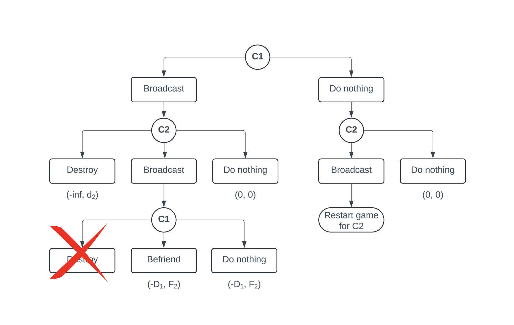

# Where be the Aliens? Game Theory, Dark Forest, and Earth's Survival

# Introduction 

Hello there! I have always greatly enjoyed (over-)thinking about the universe and its mysteries. Imagining other worlds, overindulging myself in sci-fi books and movies, replaying the Mass Effect trilogy over and over again — all the usual stuff for a person who loved astronomy and physics just a little bit too much as a kid. And yet it was only a year ago that I learned about the existence of Liu Cixin's trilogy: [Remembrance of Earth's Past](https://en.wikipedia.org/wiki/Remembrance_of_Earth%27s_Past). After having devoured all three books without even noticing the [time passing](https://www.youtube.com/watch?v=yS0yBgZrVas), I was left with my favourite post-great-read feeling. One of existential dread and cosmic horror.

Besides the pleasant shivers down my spine, I also got a fascinating idea to play with. So in this article, I want to share my thoughts on one of the most intriguing ideas explored in the trilogy: the Dark Forest theory. 

If you don't mind mild spoilers for the book series, dive in for your daily dose of man-made horrors beyond comprehension. And remember: [YOU ARE BUGS](https://www.youtube.com/watch?v=tEBIbJrUYZk)!

# But Where is Everybody?

There are over [100 billion stars](https://www.space.com/25959-how-many-stars-are-in-the-milky-way.html) in our galaxy, and over [2 trillion galaxies](https://www.skyatnightmagazine.com/space-science/how-many-galaxies-in-universe) in the observable universe. How come we haven't seen any evidence of life outside Earth? Are we the first? Or the last? The only ones? The apparent contradiction between the high probability of extraterrestrial civilizations' existence and complete lack of evidence for them has been puzzling scientists and philosophers for centuries. As you have probably heard, the question is now widely known as the [Fermi Paradox](https://en.wikipedia.org/wiki/Fermi_paradox) thanks to the physicist [Enrico Fermi](https://en.wikipedia.org/wiki/Enrico_Fermi) who, during a casual conversation with his colleagues about UFOs in the summer of 1950, asked: "But where is everybody?"

A closely related concept is the [Drake equation](https://en.wikipedia.org/wiki/Drake_equation) formulated by an American astrophysicist and astrobiologist [Frank Drake](https://en.wikipedia.org/wiki/Frank_Drake) in 1961. It represents an attempt to find a systematic way to evaluate numerous probabilities involved in the existence of alien life and estimate the number of intelligent and communicative alien civilizations. The equation was basically a great conversation starter that Drake came up with for the first scientific meeting on the search for extraterrestrial intelligence ([SETI](https://en.wikipedia.org/wiki/Search_for_extraterrestrial_intelligence)). 

The Drake equation is:

$$N = R^* \cdot f_p \cdot n_e \cdot f_l \cdot f_i \cdot f_c \cdot L$$

where:
- $N$ is the number of civilizations in our galaxy with which we might expect to be able to communicate at any given time,
- $R^*$ is the average rate of star formation in our galaxy,
- $f_p$ is the fraction of those stars that have planets,
- $n_e$ is the average number of planets that can potentially support life per star that has planets,
- $f_l$ is the fraction of planets that could support life that actually develop life at some point,
- $f_i$ is the fraction of planets with life that develop intelligent life (civilizations),
- $f_c$ is the fraction of civilizations that develop a technology that releases detectable signs of their existence into space,
- $L$ is the length of time for which such civilizations release detectable signals into space.

Naturally, the equation is highly speculative and depending on the values of the unknown (and unknowable) parameters, the result can be bent in any direction depending on the author's bias. For example, the [Wikipedia page](https://en.wikipedia.org/wiki/Drake_equation#Range_of_results) lists the ranges for over optimistic and over pessimistic estimates of the parameters resulting in the number of civilizations in the galaxy ranging from $0$ to $1.6 \times 10^7$. Not the most precise estimate, is it?

## Different Solutions

There are many proposed solutions to the Fermi Paradox. As it frequently happens with ideas, ideologies and philosophies, they evolve over time. The more humanity learns about itself the more we shape our perception of the universe. Starting with antropo- and geocentrism, we have now moved from the very center of the universe to a tiny insignificant speck of dust in the infinite cosmos. 

The same goes for the Fermi paradox solutions. With different technologies and ideas evolving over the decades, the proposed solutions have been reflecting the most up-to-date knowledge and beliefs. For example, as we deepened our understanding of the unfathomably complex mechanisms behind the emergence of life, the [Rare Earth](https://en.wikipedia.org/wiki/Rare_Earth_hypothesis) hypothesis gained popularity. 

Or as humanity started to explore the possibilities of artificial intelligence and virtual reality, the [Simulation Hypothesis](https://en.wikipedia.org/wiki/Simulation_hypothesis) became quite appealing, particularly in sci-fi movies an novels. 

Some ideas are somewhat more optimistic, like the [Zoo Hypothesis](https://en.wikipedia.org/wiki/Zoo_hypothesis). And although it implies that humanity is nothing but a cosmic zoo exhibit, too primitive to be considered equal, at least it suggests that there are other civilizations out there and they are benevolent. 

Others are more pessimistic. The [Great Filter](https://en.wikipedia.org/wiki/Great_Filter) is a direct reflection of humanity's fears of self-destruction and our understanding of how fragile and improbable life is. What if every civilization is doomed to fail and destroy itself before it reaches the stars? 

And yet my favourite proposed solution is the one that I put in the title of this piece. **The Dark Forest theory**.

# The Dark Forest

The Dark Forest theory gets its name from the second book in the amazing Liu Cixin's trilogy: [Remembrance of Earth's Past](https://en.wikipedia.org/wiki/Remembrance_of_Earth%27s_Past), although the concept itself is much older and similar ideas had been discussed already in the 1980s. 

The theory is based on two main assumptions about the universe and life in it:
- Survival is the primary need of every civilization
- Civilizations continuously grow and expand over time, but the total amount of resources in the universe is finite

The logical conclusion is that every civilization would view others as a potential threats to its own existence. Even more so, given a chance, every civilization would try to eliminate any potential threats before they have a chance to grow and pose a danger. So the proposed solution to the Fermi Paradox is that many civilizations exist in the universe but they are forced to remain silent and hidden to avoid being detected and destroyed by others. 

In Liu Cixin's own words:

> The universe is a dark forest. Every civilization is an armed hunter stalking through the trees like a ghost, gently pushing aside branches that block the path and trying to tread without sound. Even breathing is done with care. The hunter has to be careful, because everywhere in the forest are stealthy hunters like him. If he finds other life—another hunter, an angel or a demon, a delicate infant or a tottering old man, a fairy or a demigod—there’s only one thing he can do: open fire and eliminate them. In this forest, hell is other people. An eternal threat that any life that exposes its own existence will be swiftly wiped out. This is the picture of cosmic civilization. It’s the explanation for the Fermi Paradox.
> *― Liu Cixin, The Dark Forest*

Naturally, not all civilizations are considered to be the same. Some are less technologically advanced, some could be more hostile and aggressive, others more peaceful and cooperative. A civilization could be a "delicate infant" taking its first technological steps and venturing out into space or a "tottering old man" close to the end of its existence. But in the following sections, we'll show that none of this matters in the deep darkness of the cosmic forest.

# Space Prisoners  

> “Successful cooperation does not equate to successful understanding.”
> *― Liu Cixin, The Dark Forest*

In Game Theory, one of the best known textbook examples of a game is a [Prisoner's Dilemma](https://en.wikipedia.org/wiki/Prisoner%27s_dilemma). It's a thought experiment where two rational agents have to make a decision to either cooperate or betray each other. The payoffs for the agents depend on the choices they make. Unless the game is played sequentially, there's no way for the agents to communicate, learn each other's intentions and coordinate actions. As a result, the rational choice for each agent is to betray the other, even though the best outcome for both would be to cooperate. 

This setting is very similar to the Dark Forest theory. Each civilization is a rational agent trying to maximize its own survival chances. There's no way to truly learn the intentions of others and there is a limited number of actions that can be taken. 

Let's start with an illustration of the decisions that two cosmic civilizations can make, trying to closely follow the Liu Cixin's terminology from the original book. First, a few key definitions:

- $C_n$ - civilization playing the game
- $d_n$ - payoff that civilizations $C_n$ gets for destroying the other civilization
- $f_n$ - payoff that civilizations $C_n$ gets for befriending the other civilization

Civilization $C_1$ starts the game. It has two options to start with: **Broadcast** and **Do nothing**. If it chooses to **Broadcast**, it will send a signal to the universe, revealing its location. If it chooses to **Do nothing**, it will remain silent and hidden. 

If civilization $C_2$ receives a signal from $C_1$ (left branch), is can choose to **Destroy** the sender, ignore it and **Do nothing** or **Broadcast** itself. Destroying the sender would result in an infinitely negative payoff for $C_1$ and a a non-negative payoff $d_2$ for $C_2$. Doing nothing would result in a payoff of $0$ for both civilizations. Finally, broadcasting would reveal the location of $C_2$ for $C_1$ which will act next.

Having recieved a signal from $C_2$, $C_1$ has the same **Destroy** and **Do nothing** options, but also has the option to **Befriend** the other civilization. Destroying $C_2$ naturally would lead to an infinitely negative payoff for $C_2$ and a non-negative payoff $d_1$ for $C_1$. Doing nothing would once again result in a payoff of $0$ for both civilizations, and befriending would result in a non-negative payoff of $f_1$ for $C_1$ and $f_2$ for $C_2$.

The right branch of the tree represents the case where $C_1$ decides to stay silent, so the game essentially starts over with $C_2$ as the first actor.

Now let's try to find Nash equilibria for this game. 

## Analytical Solution

Let's start untangling the game tree by taking a closer look at the left branch where **broadcast from $C_1$ has already happened**. We will start from the bottom and work our way up.

After $C_2$ broadcasts its location, it puts itself in a very vulnerable position. Now the fate of $C_2$ is in the hands of $C_1$. From the payoffs we can see that depending on the values of $d_1$ and $f_1$, $C_1$ could choose any of the three options. If $d_1 > f_1 \geq 0$, it would be rational for $C_1$ to destroy $C_2$. If $0 \leq d_1 < f_1$, it would be rational for $C_1$ to befriend $C_2$. Finally, if $d_1 = f_1 = 0$, $C_1$ would be indifferent between destroying, befriending, and doing nothing. Bummer.

To add more certainty, let's get back to Liu Cixin and use his suggestions from the book. Destroying a civilization does not yield any benifits like harvesting the remaining resources. It can only eliminate a potential threat. Moreover, for both Earth and Trisolaris destroying the other civilization would be a pyrric victory. For Trisolaris that would mean losing the last hope for a stable home, and for Earth that would first have a lot of moral complications, and second, would reveal Earth's location to the rest of the universe rendering it even more vulnerable. 

On the other hand, befriending, which originated as deterrance, is fairly beneficial for both civilizations at least in the short run. Earth was gaining new technologies, and Trisolaris was learning more about Earth's culture and history. 

In this settings, we can say that $f_1 > 0 > d_1$ and $f_2 > 0> d_2$. So in the case of $C_2$ broadcasting, $C_1$ would be rational to befriend $C_2$.

Now that we have defined the payoffs, let's formulate a matrix and simplify the game assuming that the civilizations are playing (almost) simultaneously and both have the options to **Destroy**, **Do nothing**, and **Befriend**.

|         | **Destroy**  | **Befriend** | **Do nothing**  |
|---------|----------|------------|-----------|
| **Destroy** | $-\infty, -\infty$ | $d_1, -\infty$    | $d_1, -\infty$ |
| **Befriend** | $-\infty, d_2$    | $f_1, f_2$       | $0, 0$    |
| **Do nothing** | $-\infty, d_2$ | $0, 0$    | $0, 0$ |

In this matrix, the rows represent the actions of civilization $C_1$ and the columns represent the actions of civilization $C_2$. 

Now let's try eliminating dominated strategies. A strategy is dominated if there is another strategy that is always better, regardless of the opponent's choice. Taking a closer look at the *Do nothing* row, we can see that regardless of the choice of $C_2$, $C_1$ would always be better off by choosing *Befriend*. The same is true for the *Do nothing* column so we can eliminate this strategy. from the game. 

The simplified matrix is now:

|         | **Destroy**  | **Befriend** |
|---------|----------|------------|
| **Destroy** | $-\infty, -\infty$ | $d_1, -\infty$    |
| **Befriend** | $-\infty, d_2$    | $f_1, f_2$       |

Continuing the elimination process we can now see that regardless of the choice of $C_2$, $C_1$ would always be better off by choosing *Befriend* and vice versa. So the pure strategy Nash equilibrium of this game is for both civilizations to befriend each other:

|         | **Befriend** |
|---------|------------|
| **Befriend** | $f_1, f_2$|

So should we all just be friends and send greetings left and right? Well, not so fast.

## Weak and Strong Civilizations 

> “Do you know what the greatest expression of regard for a race or civilization is?” “No, what?” “Annihilation. That’s the highest respect a civilization can receive. They would only feel threatened by a civilization they truly respect.”
> *― Liu Cixin, The Dark Forest*

Let's introduce the concept of a weak and a strong civilization. A weak civilization is the one that does not have the ability to destroy others. It might not have reached the necessary technological level to do so or its resources are insufficient. A strong civilization, on the other hand, can wipe out others.

Getting back to our game tree, we will assume that $C_1$ is now a weak player and can no longer annihilate anyone. $C_2$ is still strong and can destroy $C_1$ if it chooses to. Moreover, the freidnship payoffs are shifting in favor of $C_2$ as it can now exploit $C_1$ without any fear of retaliation. 

We will assume that if $C_2$ chooses to **Befriend** it would effectively occupy $C_1$ and get all of its resources. So the payoff for $C_2$ would be $F_1 \gg f_2 > 0$, while the payoff for $C_1$ would be similar to complete destruction, let's call it $-D_1$, where $D_1 \rightarrow \infty$.

To make things worse for $C_1$, stronger $C_2$ can now forcefully **Befriend** (occupy) $C_1$ as soon as it learns about its location. 

Once again, let's build a payoffs matrix assuming that the initial broadcast of $C_1$ has already happened. This time we can remove the **Destroy** option for $C_1$ as it's no longer available:

|         | **Destroy**  | **Befriend** | **Do nothing**  |
|---------|----------|------------|-----------|
| **Befriend** | $-\infty, d_2$    | $-D_1, F_2$       | $0, 0$    |
| **Do nothing** | $-\infty, d_2$ | $-D_1, F_2$    | $0, 0$ |

As we can see, the outcomes for $C_1$ are the same regardless of the choice of $C_2$. We can simplify the matrix by eliminating the dominated strategies of $C_2$:

|         | **Befriend** |
|---------|------------|
| **Befriend** | $-D_1, F_2$|
| **Do nothing** | $-D_1, F_2$|

So the Nash equilibrium of this game is occupation of $C_1$ by $C_2$:

|         | **Occupy** |
|---------|------------|
| **Become occupied** | $-D_1, F_2$|

From this result alone it's already clear that for a weak civilization, it's better to not initiate contact with a strong one at all. And how could we as a civilization know if a weak or strong counterpart is listening on the other end? Well, that's the neat part. We don't. 

## Incomplete Information and Why Beliefs Matter

The result above, devastating for $C_1$, is only true if $C_2$ knows or, rather, *believes*, that $C_1$ is weak. How would the game unfold if despite $C_1$ being weak, $C_2$ would not be sure about it? 

We are now entering a domain of games with incomplete information, where players may not know strategies, payoffs, or "types" of other players. In our case, a civilization may only know its own strength, but not the strength of the other civilization and has to make decisions based on beliefs.

Let's analyse this scenario from a positoin of a civilization receiving the signal, $C_2$. As the civilisation listens to a message from dark corners of the universe, it starts wondering. Who is the sender? What are their intentions? What kind of technological level they had achieved by the time the message was sent? And finally, what should the people of $C_2$ do about it?

As we have seen form the previous outcomes, [peace is rarely an option](https://i.kym-cdn.com/entries/icons/original/000/018/215/cover8.jpg). If $C_2$ decides to reply and reveal itself, its best-case scenario is for $C_1$ to be either equally strong to engage in fragile deterrence or weaker to be occupied. But what if it's stronger? Or if it will have become stronger when the reply reaches them? Is this all a [trap?](https://media.giphy.com/media/v1.Y2lkPTc5MGI3NjExNHBvb3dzYmM1OWRvanllcWlsa2N3cWg1bmc3andhcDFoZXkzcml5YSZlcD12MV9naWZzX3NlYXJjaCZjdD1n/3ornka9rAaKRA2Rkac/giphy.gif) A way to lure other civilizations out of hiding and then consume them? The uncertainty is terrifying.

Let $p$ be the belief probability that $C_1$ is weaker, $q$ be the belief that it's equally strong and $1-p-q$ that it's stronger. Based on the results form out previous analyses, the payoffs for $C_2$ would be: 
- $F_2$ in case $C_1$ is weaker, ($C_2$ occupies/consumes/destroys $C_1$)
- $f_2$ in case $C_1$ is equally strong (fragile deterrence)
- $-D_2$ in case $C_1$ is stronger ($C_2$ gets occupied/consumed/destroyed)

Putting it all together and using belief probabilities as weights, we get the final payoff for $C_2$ as a function of $p$ and $q$:

$$\text{Total Payoff}_{C_2}(p, q) = p \cdot F_2 + q \cdot f_2 + (1-p-q)\cdot(-D_2)$$

Remembering that $D_2 \rightarrow \infty$, it becomes clear that no matter the beliefs of $C_2$, the percpective of being occupied (with a potential of being completely wiped out) would outweigh any potential benefits of replying:

$$\text{Total Payoff}_{C_2}(p, q) \rightarrow -\infty$$

So what is the reasonable thing for $C_2$ to do? Obviously nothing. Just stay silent and hidden.

But then comes another realization. What if $C_1$ is planning to expand and will eventually detect and threaten $C_2$ anyway? How can $C_2$ prevent this from happening? The answer is simple. Destroy a potential competitor $C_1$ before it has a chance to grow. And if $C_2$ does not yet have the power to do so, it's in their civilization's best interest to start developing the ultimate weapon as soon as possible hoping to stay undetected in the meantime. 

Now all of this is very gloomy and pessimistic. Surely there are friendly aliens out there who are as curious, open-minded, and peaceful as human civilization will hopefully be sometime in the future? Shouldn't we actively try to reach out to them and establish contact? Well, let's see how this would play out from the perspective of the original messenger, $C_1$.

# Extending to N civilizations

So far we have been considering a game between two civilizations. But in the observable universe there are billions of stars, planets, and potentially civilizations. We finally extend the game and welcome many more alien participants. $C_1$ still has an option to send our a signal, but now there are countless civilizations listening. If they recieve a signal, they have to make a decision based on the beliefs about the strength of the sender and the potential threats it poses.

Let's introduce a few variables:

- Let $p$ be the probaility that that a civilization $C_n$ receiving the message is equal to or weaker than $C_1$
- $(1-p)$ would be the probability that $C_n$ is stronger
- $N$ is the total number of civilizations that got the message from $C_1$
​

Now with those variables in mind, we can say that there should be $pN$ civilizations that are equal to or weaker than $C_1$ and $(1-p)N$ civilizations that are stronger. From our previous analysis we know that the equilibrium outcome for $C_1$ when it encounters a weaker civilization is $F_1$, for an equally strong civilization is $f_1$, and for a stronger civilization is either $-D_1$ if the stronger one decides to occupy, where $D_1 \rightarrow \infty$, or simply $-\infty$ if it immediately decides to destroy $C_1$. 

To make the analysis simpler, let's say that encountering a weaker or equally strong civilization is generally a positive case for $C_1$, and the payoff could be some probability-weighted function of $F_1$ and $f_1$: $P_1(f_1, F_1) \geq 0$. Since there are $pN$ such civilizations, and chances of encountering them are completely independent, the total positive payoff for $C_1$ would be $pN \cdot P_1(f_1, F_1)$.

On the other hand, getting exposed to a stronger civilization ends up in either desctruction or occupation, and the fact that out there might be $(1-p)N$ of strong ones does not make things easier for feeble $C_1$. The negative payoff could be another probability-weighted function, depending on the choice of the stronger civilization. For simplicity, let's say that it's always $-D_1$, so the total payoff for $C_1$ in this case would be $(1-p)N \cdot (-D_1)$.

Combining the two terms together, we get the total payoff for $C_1$ after sending out a signal:

$$
\begin{align*}
\text{Total Payoff}_{C_1}(p, q) &=  pN \cdot P_1(f_1, F_1) + (1-p)N \cdot (-D_1) \\
                    &= N \cdot (p \cdot P_1(f_1, F_1) - (1-p) \cdot D_1)
\end{align*}
$$

Given that $D_1 \rightarrow \infty$, the term $(1-p) \cdot D_1$ would dominate as long as there is a non-zero probability of encountering a stronger civilization, i.e. $(1-p) > 0$. The total payoff for $C_1$ then tends towards:

$$
\begin{align*}
\text{Total Payoff}_{C_1}(p, q) &\propto - (1-p) \cdot D_1\\
                    &\propto -\infty
\end{align*}
$$

This means that as long as there is a singe strong civilization capable of figuring out the location of $C_1$, the total payoff for $C_1$ would be infinitely negative. Only a very naive civilization that either thinks it's the strongest in the universe or is completely ignorant of the potential threats would be willing to initiate contact.

But wait, there is a civilization like that. It's us.

<!-- Important! The civilization that fears the dark forest is bening, but ones that do not fear would exapd, attack, and destroy others and so are evil and must be eliminated.

In the eyes of external observer, who would dare to broadcast their location? -->

# How screwed are we? 

> "There is a fear of the night that is begotten of ignorance and superstition, a nightmare fear, the fear of the impossible; and there is another fear of the night―of the starlit night―that comes with knowledge, when we see in its true proportion this little life of ours..." 
> *― H.G. Wells, From An Observatory*

Humanity has been whispering into the void ever since the first radio waves started travelling through space. Most of the signals that leaked into the universe were not intentionally sent to communicate with extraterrestrial civilizations, but rather a byproduct of our technological progress. However, some attempts were symbolically intentional, like the [Arecibo message](https://en.wikipedia.org/wiki/Arecibo_message) or the [Voyager Golden Record](https://en.wikipedia.org/wiki/Voyager_Golden_Record). 

Naturally, the radio waves have been exceptionally weak and chances of them being detected by an alien civilization are slim. We can do some napkin math and estimate what would be the required power of a signal to be detectable from a certain distance.

Since the introduction of radio waves, the signals have been travelling through space for about 100 years. The first radio waves were sent at the end of 19th century by [Guglielmo Marconi](https://en.wikipedia.org/wiki/Guglielmo_Marconi), the first intentional radio signal was sent in 1906 by [Reginald Fessenden](https://en.wikipedia.org/wiki/Reginald_Fessenden), and the first commercial radio broadcast was in 1920 by [Westinghouse Electric and Manufacturing Company in Pittsburgh](https://www.fcc.gov/media/radio/history-of-commercial-radio). 

Most of these signals drowned in Earth's atmosphere or were obscured by radio emissions from the Sun. However, with the introduction of [military radars](https://www.sciencefocus.com/space/how-far-from-earth-could-aliens-detect-our-radio-signals), the power and frequency charachteristics of the signals allowed them to overcome this interference. So let's say that the signals have been travelling for about 100 years. And since radio waves travel at the speed of light in the vacuum of space, we assume they have travelled about 100 light-years.

Radio waves spread out as they travel, and their intensity diminishes following the inverse square law. This means that the power density $P$ of a signal at a distance $d$ from the source is inversely proportional to the square of the distance:

$$P \propto\frac{1}{d^2}$$

In telecommunication, [Free-space path loss (FSPL)](https://en.wikipedia.org/wiki/Free-space_path_loss) is used to measure the attenuation of radio waves as they travel between antennas. The formula for FSPL is:

$$FSPL = \left( \frac{4\pi d f}{c} \right)^2$$

where:

- $d$ is the distance between the antennas,
- $f$ is the frequency of the signal,
- $c$ is the speed of light.

To make calculations easier, we can [express FSPL is in terms of decibels](https://en.wikipedia.org/wiki/Free-space_path_loss#:~:text=2-,Free%2Dspace%20path%20loss%20in%20decibels,-%5Bedit%5D):

$$FSPL_{dB} = 20 \log_{10}(d) + 20 \log_{10}(f) - 147.5$$

For a frequency of 1 GHz, the FSPL at a distance of 100 light-years (9.46⋅1017 meters) would be:

$$
FSPL_{dB} = 20 \log_{10}(9.46 \times 10^{17}) + 20 \log_{10}(10^9) - 147.5 \approx 392 \text{ dB}
$$

Required transmission power $P_{0}$, considering gains and losses (including FSPL), can be estimated through the [link budget equation](https://en.wikipedia.org/wiki/Link_budget):

$$
P_{r} = P_{t} + G_{t} + G_{r} - FSPL_{dB}
$$

where:
- $P_{r}$ is the detectable power level at the receiver, considering modern radio telescopes can detect signals as weak as $-160$ dBm (Arecibo Observatory),
- $P_{t}$ is the transmission power,
- $G_{t}$ is the gain of the transmitting antenna,
- $G_{r}$ is the gain of the receiving antenna

Rearranging for $P_{t}$, we get:

$$
P_{t} = P_{r} - G_{t} - G_{r} + FSPL_{dB}
$$

We will assume that $G_r$ is 0 dBi. Naturally, higher-gain antennas would be able to increase the strength of the signal both at the source and at the receiver, but they would have to be pointed directly at each other. Since aliens (presumably) do not yet know our location, their only hope of detecting our signals would be by scanning the whole sky. For $G_t$, we can take a standard gain of a radio antenna which could reach around 20 dBi. Then the required transmission power would be:

$$
P_{t} = -160 - 20 - 0 + 392 = 212 \text{ dBm} = 1.58 \times 10^6 \text{ TW}
$$

To give you a sense of scale, the annual global power consumption of the Earth from all energy sources is around [17.7 TW](https://www.theworldcounts.com/stories/current-world-energy-consumption). So the required power to send a signal that could be detected from 100 light-years away would be about 90,000 times the total energy consumption of the Earth. That's why Ye Wenjie used the Sun as a massive amplifier to reach out to the Trisolarans.

With the existing power of advanced modern radio transmitters, which is around 1-3 MW (1 MW = 90 dBm), the resulting signal would be indistinguishable from the cosmic radiation background noise at a distance of 100 light-years:

$$
\begin{align*}
P_{r} &= P_{t} + G_t + G_r - FSPL_{dB} \\
&= 90 + 20 + 0 - 392 \\
&= -282 \text{ dBm}
\end{align*}
$$

So the chances of any civilization detecting our signals are slim to none.

But let's imagine that a wise and technologically advanced civilization would invest a lot of resourced into building the most sensitive equipment to detect even the faintest signals from the universe. After all, their survival depends on it. 

We don't have a very good estimate of how many stars are there in the 100-light-year bubble around Earth, but we can use the [Stellar density](https://en.wikipedia.org/wiki/Stellar_density) in the [Local Interstellar Cloud](https://en.wikipedia.org/wiki/Local_Interstellar_Cloud) to get a rough estimate. The Local Interstellar Cloud is roughly 30 light-years accross (9.2 parsecs) and overlaps with a region aroud the Sun called the [Local Bubble](https://en.wikipedia.org/wiki/Local_Bubble). It is estimated that the average stellar density around the Sun is 0.14 stars per cubic parsec. 1 parsec is approximately 3.262 light-years. So the number of stars in the 100-light-year (or 30.7 parsec) bubble around Earth would be:

$$
\begin{align*}
\text{Volume of the bubble} &= \frac{4}{3} \pi r^3 \\
                            &= \frac{4}{3} \pi (30.7 \text{ parsecs})^3 \\
                            &\approx 1.21 \times 10^5 \text{ cubic parsecs}
\end{align*}
$$

$$
\begin{align*}
\text{Number of stars} &= 0.14 \text{ stars/ pc}^{3} \times 1.21 \times 10^5 \text{ pc}^{3} \\
                       &\approx 1.69 \times 10^4 \text{ stars}
\end{align*}
$$

There is, however, an alternative estimate provided by Adam Kirk in his [blog post](https://lovethenightsky.com/stars-within-100-light-years/). Based on the [SkySafari 6](https://skysafariastronomy.com/) software data he writes that there are **59,722** stars within 100 light-years of Earth. We'll use both estimates in our further calculations to get a range of possible outcomes.

Of those stars, [around 20% would be Sun-like](https://www.forbes.com/sites/startswithabang/2019/10/01/astronomers-debate-how-many-habitable-planets-does-each-sun-like-star-have/#:~:text=We%20know%20that%20there%20are,like%20stars%20in%20our%20galaxy.). And out of those, [about 22% would have planets in the habitable zone](https://news.berkeley.edu/2013/11/04/astronomers-answer-key-question-how-common-are-habitable-planets/). So the number of potentially habitable planets in the 100-light-year bubble around Earth would be:

$$
\begin{align*}
\text{Number of Sun-like stars} &= \begin{cases}
0.2 \times 1.69 \times 10^4 & \text{(low estimate)} \\
0.2 \times 5.97 \times 10^4 & \text{(high estimate)}
\end{cases} \\
&\approx \begin{cases}
3.38 \times 10^3 \\
1.19 \times 10^4
\end{cases}
\end{align*}
$$

$$
\begin{align*}
\text{Number of habitable planets} &= \begin{cases}
0.22 \times 3.38 \times 10^3 & \text{(low estimate)} \\
0.22 \times 1.19 \times 10^4 & \text{(high estimate)}
\end{cases} \\
&\approx \begin{cases}
0.74 \times 10^3 \\
2.62 \times 10^3
\end{cases}
\end{align*}
$$

The final step is to estimate how many of those planets could have developed intelligent life and potentially be listening to our signals. This is the most speculative number we've had so far, so in an attempt to be as conservative as possible, we'll use the existing estimates for Drake equation. As you remember, in the equation, $f_l$ is the fraction of planets that could support life that actually develop life at some point and $f_i$ is the fraction of planets with life that develop intelligent life. The estimates for $f_l$ and $f_i$ are very uncertain, so we'll use both the lower and upper estimates from the [Wikipedia page](https://en.wikipedia.org/wiki/Drake_equation). The lower estimate for $f_l$ is $10^{-5}$ and the upper estimate is $0.13$, and the lower estimate for $f_i$ is $10^{-9}$ and the upper estimate is $1$.

$$
\begin{align*}
\text{Number of civilizations} &= \text{Number of planets} \cdot f_l \cdot f_i \\
&= \begin{cases}
0.74 \times 10^3 \times 10^{-5} \times 10^{-9} & \text{(low estimate)} \\
2.62 \times 10^3 \times 0.13 \times 1 & \text{(high estimate)}
\end{cases} \\
&\approx \begin{cases}
7.4 \times 10^{-12} \\
3.4 \times 10^2
\end{cases}
\end{align*}
$$

So the worst (best?) case scenario is that there are around **340 civilizations** in the 100-light-year bubble around Earth that could pottentially be listening to the signals from space, and the best (worst?) case scenario is that there are likely none. 

# So what to do?

> “Staying alive is not enough to guarantee survival. Development is the best way to ensure survival.”
> *― Liu Cixin, The Dark Forest*

> "Since, in the long run, every planetary society will be endangered by impacts from space, every surviving civilization is obliged to become spacefaring — not because of exploratory or romantic zeal, but for the most practical reason imaginable: staying alive."
> *― Carl Sagan, Pale Blue Dot*

# Criticism of Dark Forest theory